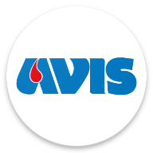

  

---

  
    <b>AnAVIS</b>, progetto realizzato in <b>Flutter</b> e <b>Spring</b> per il corso di laurea <b>L-31</b> presso <b>Unicam</b>, <i>nell'anno accademico 2019/2020</i>, realizzato dagli studenti Marco Zamponi, Francesco Pio Stelluti e Francesco Coppola per l'esame di <b>Ingegneria del Software</b> seguendo i canoni di sviluppo proposti
      <b>
<a href="https://www.unicam.it/">• Unicam</a>
<a href="https://avis.it">• AVIS</a>
<a href="https://it.wikipedia.org/wiki/Licenza_MIT">• Licenza</a>
<a href="https://www.youtube.com/watch?v=dQw4w9WgXcQ">• Contribuisci</a>
<a href="https://github.com">• </img></a>
</b>

# 📝 Tabella dei contenuti

- [Panoramica](#panoramica)
- [Tecnologie di base](#tecno)
- [Storico incontri](#history)
- [Consegne](#consegne)
- [Autori](#autori)

# 🧐 Panoramica 

Attualmente per poter prenotare una donazione **AVIS**, i donatori devono telefonare o recarsi in una sede la quale riferirà loro quali sono i giorni e gli orari disponibili presso quella sede, infatti, ad ogni donazione, prima del prelievo si deve compilare un modello cartaceo in cui si attestano le proprie condizioni di salute.

Il sistema proposto renderebbe più **veloce** e **smart** la pratica di **prenotazione** e risulterebbe più comodo per i donatori scegliere fra tutte le date e gli orari disponibili nelle varie sedi AVIS.

Le sedi AVIS risparmieranno tempo in quanto interagiranno con il sistema solo per inserire gli orari e le date disponibili per le donazioni, senza più occuparsi _direttamente_ delle prenotazioni che vedranno in un elenco.

# 🔨 Tecnologie di base 

Il lato frontend dell’applicativo si rivolge al mondo Android ed è stato sviluppato in un linguaggio di programmazione molto recente chiamato Dart mediante il framework Open Source, sviluppato dal team di Google, **Flutter**.

Per la programmazione del backend invece la scelta è ricaduta su un backend robuto e affidabile chiamato **Spring**.

# ⏰ Storico incontri 

È possibile controllare lo storico degli incontri del team **Программная инженерия** mediante il [file](https://docs.google.com/document/d/1HMiIRdHMAMtNOgoLFl8B7xCcTn9bTPi2uBCD9vcceFk/edit?usp=sharing) qui allegato.

Le riunioni sono state effettuate nella maggior parte dei casi con la **totalità** del team presente affinchè ci fosse una maggiore consapevolezza sulle attività da **sviluppare** e portare avanti lungo la durata dell'**iterazione** corrente.

# 📯 Consegne 

Le **date di consegna** possono essere consultate seguendo la seguente tabella:

| Numero iterazione |    Data    | Settimana di consegna |
| :---------------: | :--------: | :-------------------: |
|        1°         | 30/11/2019 |         Prima         |
|        2°         | 14/12/2019 |         Terza         |
|        3°         | 04/01/2020 |         Sesta         |
|        4°         | 18/01/2020 |        Ottava         |
|        5°         | 01/02/2020 |        Decima         |

# 🧸 Autori 

- [Francesco Coppola](https://github.com/azzeccagarbugli)
- [Francesco Pio Stelluti](https://github.com/FrancisFire)
- [Marco Zamponi](https://github.com/ZamponiMarco)
